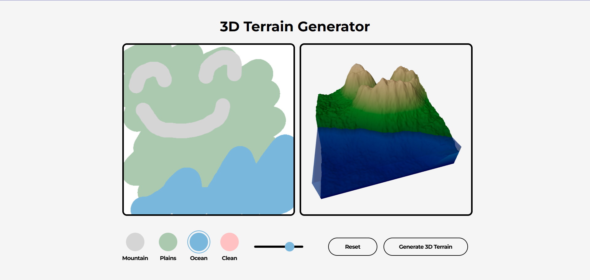

# 3D Terrain Generator

A web-based 3D terrain generator that allows users to create 3D terrain models by drawing 2D images.



## Project Overview

This project is an interactive 3D terrain generation tool with the following features:

- **Intuitive Drawing Interface**: Users can draw terrain on a canvas
- **Multiple Terrain Types**: Supports mountains, plains, oceans, and cleaning tools
- **Real-time 3D Preview**: Uses Three.js to render 3D terrain models
- **Noise-based Terrain Generation**: Uses Perlin noise algorithm to generate natural terrain

## Tech Stack

### Frontend
- **React 19** - User interface framework
- **TypeScript** - Type-safe JavaScript
- **Three.js** - 3D graphics rendering
- **React Three Fiber** - React integration for Three.js
- **Tailwind CSS** - Styling framework
- **Vite** - Build tool

### Backend
- **Python** - Backend language
- **FastAPI** - Web framework
- **NumPy** - Numerical computing
- **OpenCV** - Image processing
- **Perlin Noise Algorithm** - Terrain generation algorithm

## Project Structure

```
├── frontend/         # React frontend application
│   ├── src/          # Source code
│   ├── public/       # Static assets
│   └── package.json  # Frontend dependencies
├── backend/          # Python backend service
│   ├── app.py        # FastAPI application
│   ├── terrain_generator.py  # Terrain generation algorithm
│   └── requirements.txt      # Python environment configuration
├── server/           # Node.js server (optional)
├── package.json      # Root project configuration
├── docs/             # Some related docs
│   ├── screenshots           # Screenshots of the application
└── README.md         # Project documentation
```

## Installation and Setup

### Prerequisites
- Node.js 18+
- Python 3.8+
- npm or yarn package manager

### 1. Install Dependencies

```bash
# Install frontend dependencies
cd frontend
npm install

# Install backend dependencies
cd ../backend
pip install -r requirements.txt
```

### 2. Start Services

**Method: Use TWO terminal windows**

#### Terminal 1: Start Backend Service
```bash
cd backend
python -m uvicorn app:app --reload --port 8000
```

#### Terminal 2: Start Frontend Service
```bash
cd frontend
npm run dev
```

### 3. Access the Application

- **Frontend Interface**: http://localhost:5173
- **Backend API Documentation**: http://localhost:8000/docs
- **Health Check**: http://localhost:8000/health

### 4. Usage Instructions

1. **Draw Terrain**: Draw terrain contours on the left canvas
2. **Select Tools**: Choose mountain, valley, ocean, or clean tools
3. **Adjust Brush**: Use the slider to adjust brush size
4. **Generate Model**: Click "Generate 3D Terrain" button
5. **View Results**: View the generated 3D terrain in the right panel

## API Endpoints

### Generate Terrain Model
- **POST** `/generate-terrain`
- **Parameters**: Image file (FormData)
- **Returns**: Model filename

### Health Check
- **GET** `/health`
- **Returns**: Service status

## Development Notes

### Terrain Generation Algorithm

The project uses noise algorithm and my own mountain generate algorithm to generate natural terrain. Algorithm flow:

1. Convert 2D image to height map
   
   1.1 Mountain detect
   
   1.2 Mountain shape classifier (if there are mountains)
   
   1.3 Generate peak point --> peak-lines --> ridges (random direction generation segment by segment)
   
   1.4 Weaken peak points and strengthen peaklines and ridges, and blur
   
3. Apply noise to generate terrain variations
4. Generate 3D mesh model
5. Export as GLB format

### Frontend Architecture

- `App.tsx` - Main application component
- `Render.tsx` - 3D rendering component
- Uses Canvas API for drawing
- Uses Three.js for 3D rendering

## Contributing

Issues and Pull Requests are welcome to improve this project.

One problem: The output 3D terrain model is a mirror image of the input graffiti. Although I have tried some methods, I still haven't found a perfect fix. You are welcomed to contact me (raywei99@outlook.com) if you have any idea about this.

## Acknowledgements

This project was part of a group project. I was responsible for the manual 3D terrain model generation algorithm, while two other teammates worked on the GAN training algorithm for satellite map generation and front-end development, respectively. I would like to express my sincere gratitude for their contributions!

I have to say it was a fascinating process--from brainstorming to code implementation--although with some setbacks. Initially, the results were unsatisfactory, but then I realized that if I wanted to simulate a real-world terrain, I should first study from the reality. So I analyzed numerous mountain images, studying the trends and orientations of mountain ranges and ridges. Ultimately I developed this little algorithm for manually simulating terrain, specifically mountains.

I extracted and shared my algorithm here and redeveloped the corresponding front-end, resulting in this small project. I hope it will be fun to you.
